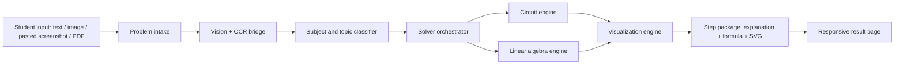
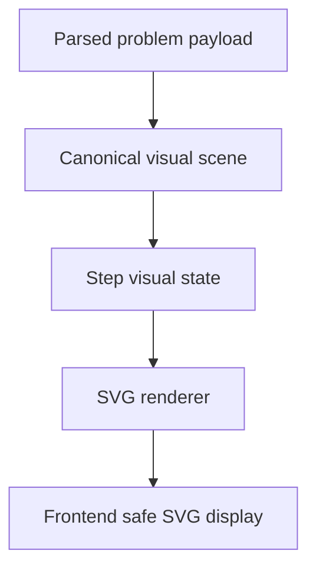
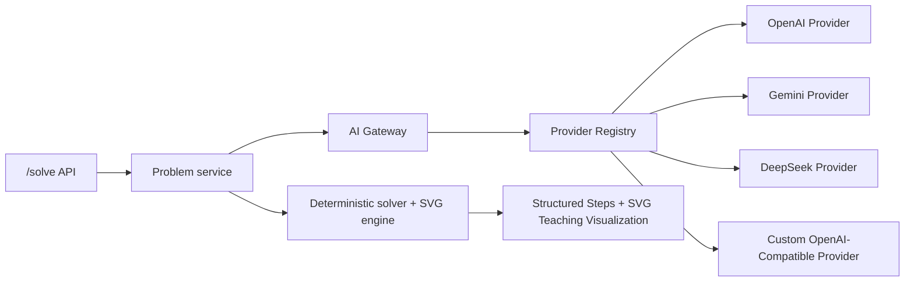
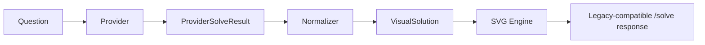
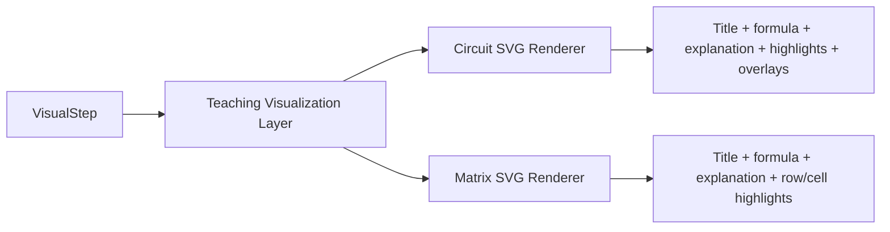
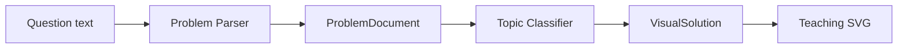
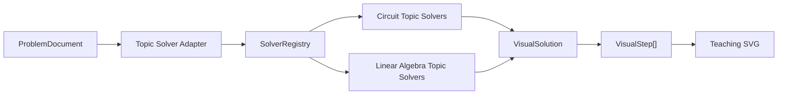
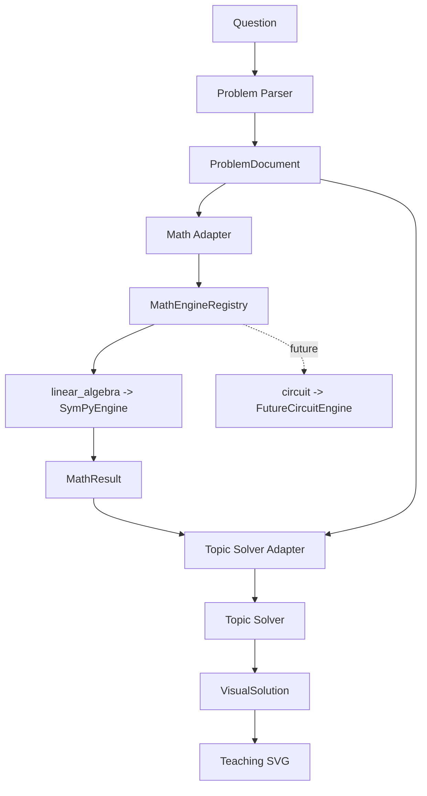
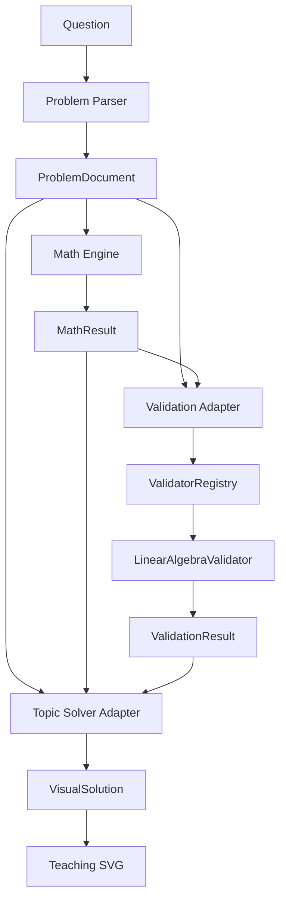

# crh create AI V2 Architecture

## 1. Product Architecture

crh create AI is an engineering-learning visual solver. It is not a chat app and not a search-answer site. The primary object is a synchronized learning sequence:



Success metric: a student can understand the reasoning from the step graphics and short teacher explanation without depending on the final answer.

## 2. Frontend and Backend Directory Structure

```txt
crh-create-ai/
├─ apps/
│  ├─ web/
│  │  ├─ app/
│  │  │  ├─ globals.css
│  │  │  ├─ layout.tsx
│  │  │  └─ page.tsx
│  │  ├─ components/
│  │  │  ├─ intake-panel.tsx
│  │  │  ├─ model-selector.tsx
│  │  │  ├─ result-layout.tsx
│  │  │  ├─ step-list.tsx
│  │  │  └─ visualization-panel.tsx
│  │  ├─ lib/
│  │  │  ├─ api.ts
│  │  │  └─ types.ts
│  │  └─ package.json
│  └─ api/
│     ├─ app/
│     │  ├─ main.py
│     │  ├─ api/routes.py
│     │  ├─ ai/
│     │  │  ├─ gateway.py
│     │  │  ├─ model_registry.py
│     │  │  ├─ model_router.py
│     │  │  ├─ prompts.py
│     │  │  └─ providers/
│     │  │     ├─ base.py
│     │  │     ├─ deepseek.py
│     │  │     ├─ gemini.py
│     │  │     └─ openai.py
│     │  ├─ core/config.py
│     │  ├─ schemas/
│     │  │  └─ solution.py
│     │  ├─ services/problem_service.py
│     │  ├─ solvers/
│     │  │  ├─ circuit_solver.py
│     │  │  └─ matrix_solver.py
│     │  └─ visualization/
│     │     ├─ circuit_svg.py
│     │     └─ matrix_svg.py
│     └─ requirements.txt
├─ docs/
│  └─ architecture.md
├─ .env.example
├─ docker-compose.yml
└─ README.md
```

## 3. Data Model

Core API models:

```txt
Subject
- id: circuit | linear_algebra
- label
- topics

Topic
- id: node_analysis | mesh_analysis | thevenin | inverse_matrix | eigenvalue ...
- subject_id
- label

Problem
- id
- input_mode: text | image | paste | pdf
- subject
- topic
- original_text
- image_data_url
- parsed_payload
- model_selection

Solution
- id
- problem_id
- subject
- topic
- summary
- confirmation_required
- steps: Step[]

Step
- id
- index
- title
- teacher_explanation
- formula
- visualization: Visualization

Visualization
- id
- kind: circuit_svg | matrix_svg | overlay_svg
- mode: textbook | analysis | overlay
- svg
- highlights
```

Storage can start in-memory for V2 MVP. When accounts/history are needed, persist `Problem`, `Solution`, `Step`, `Visualization`, and `UsageEvent` in PostgreSQL.

## 4. API Design

```txt
GET /health
GET /models
POST /solve
```

`POST /solve` accepts multipart form data:

```txt
question?: string
subject?: circuit | linear_algebra | auto
profile: auto | quality | balanced | fast | economy
provider: openai | gemini | deepseek | auto
model?: string
file?: image/pdf
```

Response:

```json
{
  "solution": {
    "subject": "circuit",
    "topic": "node_analysis",
    "confirmation_required": true,
    "steps": [
      {
        "index": 1,
        "title": "重绘电路图",
        "teacher_explanation": "先确认连接关系，避免后面所有方程建立在错误电路上。",
        "formula": "Vs = 18V, R1 = 2Ω ...",
        "visualization": {
          "kind": "circuit_svg",
          "mode": "textbook",
          "svg": "<svg>...</svg>"
        }
      }
    ]
  }
}
```

## 5. SVG Generation Flow



Circuit SVG rules:
- Use white background and black strokes.
- Preserve original topology before beautifying.
- Generate independent SVG per step.
- Modes: textbook, analysis, overlay.

Matrix SVG rules:
- No pure text-only matrix output.
- Render each matrix as SVG-like structured UI or backend-generated SVG.
- Each row operation produces a before/work/after visual.

## 6. Circuit Diagram Engine

V2 uses a staged circuit engine:

1. Vision extraction: identify components, nodes, values, and rough positions.
2. Canonical graph: components, terminals, nets, coordinates.
3. Textbook renderer: preserves branch structure and recognizable layout.
4. Analysis renderer: adds nodes, currents, voltages, KCL/KVL marks.
5. Overlay renderer: maps labels and arrows onto the original image.

DeepSeek optimization: DeepSeek is not used for raw image perception. If selected, a vision-capable bridge model first converts the image into text/netlist/coordinates; DeepSeek then receives the structured problem for reasoning.

## 7. Linear Algebra Visualization Engine

The linear algebra engine emits a `MatrixStepScene`:

```txt
before_matrix
operation
highlight_rows
highlight_cells
work_lines
after_matrix
```

Each step becomes an independent SVG/visual package:

```txt
initial matrix
operation arrow
highlighted row/cell
row arithmetic
new matrix
```

## 8. AI Prompt Architecture

Prompts are task-specific and short:

```txt
vision_extract
- Extract problem text, subject, topic, circuit components, matrix values.

problem_parse
- Convert raw extraction into strict JSON.

solve_reasoning
- Produce step plan. Do not over-explain.

teacher_explain
- For each step, answer "为什么这样做？" in <= 3 sentences.

visual_scene
- Convert step into renderable visual state.
```

Provider routing:

```txt
OpenAI/Gemini: vision_extract
OpenAI/DeepSeek/Gemini: solve_reasoning
OpenAI/Gemini/DeepSeek: teacher_explain
DeepSeek image path: image -> vision bridge -> structured text -> DeepSeek
```

## 8.1 Provider Architecture

V3 moves every model call behind a provider interface. Solvers must not import OpenAI, Gemini, DeepSeek, or any concrete SDK.



Provider interface:

```txt
AIProvider
- solve(request) -> ProviderSolveResult
- list_models() -> list[ProviderModel]
- validate_config() -> ProviderValidation
```

Unified provider result:

```json
{
  "answer": "...",
  "steps": [],
  "confidence": 0.0,
  "metadata": {}
}
```

The normalized result prevents business code from handling provider-specific response formats.

### Provider Registry

`ProviderRegistry` supports:

```txt
register_provider(provider)
get_provider(name)
list_providers()
remove_provider(name)
```

Adding a provider should not require changing solvers. New providers are registered from configuration and then discovered through the registry.

### OpenAI-Compatible Custom Provider

The `CustomProvider` speaks `/chat/completions`, so it can connect to OpenAI-compatible gateways:

```txt
OpenRouter
SiliconFlow
OneAPI
NewAPI
Volcengine Ark
Alibaba Bailian OpenAI-compatible endpoints
```

Environment configuration:

```txt
CUSTOM_PROVIDER_NAME=custom
CUSTOM_API_KEY=...
CUSTOM_BASE_URL=https://your-compatible-host/v1
CUSTOM_MODEL=your-model-id
CUSTOM_TEMPERATURE=0.2
CUSTOM_MAX_TOKENS=1800
```

Then call the existing API without changing frontend or solver code:

```txt
POST /solve
provider=custom
model=your-model-id
```

### Dynamic Models API

`GET /models` now returns providers from the registry:

```json
{
  "providers": [
    {
      "name": "openai",
      "configured": false,
      "models": []
    },
    {
      "name": "custom",
      "configured": true,
      "models": []
    }
  ]
}
```

## 8.2 VisualStep Architecture

V4 standardizes every provider result before it reaches solvers, validators, topic classifiers, exporters, or SVG renderers.



Core rule:

```txt
Provider raw output must never be consumed directly by SVG Engine.
```

### VisualStep

```json
{
  "id": "string",
  "title": "string",
  "explanation": "string",
  "formula": "optional string",
  "svgType": "circuit | matrix | generic | future",
  "result": "optional string",
  "highlights": [
    {
      "target": "R1",
      "type": "component",
      "metadata": {}
    }
  ],
  "annotations": [],
  "overlays": [],
  "metadata": {}
}
```

The schema is intentionally subject-neutral so future modules such as calculus, physics, analog electronics, digital electronics, signals, and control can reuse the same pipeline.

### VisualSolution

```json
{
  "answer": "string",
  "confidence": 0.0,
  "topic": "optional string",
  "difficulty": 2,
  "steps": []
}
```

### Responsibility Boundaries

```txt
Provider
- Calls external API.
- Converts API response into ProviderSolveResult only.

Normalizer
- Converts ProviderSolveResult into VisualSolution.
- Hides provider-specific response differences.

Solver / Fallback
- Produces deterministic VisualSolution when provider output is empty or unavailable.

SVG Engine
- Accepts VisualStep only.
- Does not branch on provider name.

/solve adapter
- Keeps old frontend fields while exposing visual_solution for future clients.
```

## 8.3 Teaching Visualization Layer

V5 makes `VisualStep` fields renderable. The SVG Engine consumes only `VisualStep`; it does not know provider names and does not inspect raw model output.



Supported fields:

```txt
highlights
- component: R1, R2, R3, Vs
- node: Node A, Node B, Ground
- row: matrix row index
- cell/result_cell: matrix cell coordinates

annotations
- formula notes
- row operation notes
- teacher notes

overlays
- labels placed near circuit targets
- optional x/y coordinates for future image overlay mode
```

Before V5:

```txt
VisualStep.highlights existed but SVG mostly used metadata hot/result arrays.
```

After V5:

```txt
VisualStep.highlights / annotations / overlays are rendered into SVG.
Every SVG includes:
- Step title area
- Formula area
- Explanation area
- Teaching highlights
```

## 8.4 Problem Parser Architecture

V6 introduces a text-first parser layer. This stage does not perform OCR, PDF OCR, symbolic solving, PySpice, Lcapy, or SymPy work. Its only job is to understand the input question enough to create a structured `ProblemDocument`.



### ProblemDocument

```json
{
  "id": "string",
  "domain": "circuit | linear_algebra | generic",
  "topic": "string",
  "difficulty": 1,
  "sourceType": "text",
  "originalQuestion": "string",
  "knowns": [],
  "targets": [],
  "constraints": [],
  "metadata": {}
}
```

Supported V6 topics:

```txt
Circuit
- resistor_series
- resistor_parallel
- mesh_analysis
- node_voltage
- thevenin
- norton

Linear Algebra
- gaussian_elimination
- matrix_rank
- inverse_matrix
- determinant
- eigenvalue

Unknown
- generic
```

Parser registry:

```txt
ParserRegistry
- register_parser()
- get_parser()
- list_parsers()
- parse()
```

The `/solve` response keeps old fields and adds:

```txt
solution.problem_document
```

## 8.5 Topic Solver Adapter Architecture

V7 connects `ProblemDocument.topic` to topic-specific visual solvers. Provider, Normalizer, SVG Engine, UI, database, and user-system work remain paused.

The V7 goal is not numeric solving yet. Its goal is topic-aware teaching: different topics now produce different `VisualStep` sequences instead of sharing one generic template.



Adapter responsibility:

```txt
TopicSolverAdapter
- Accepts ProblemDocument.
- Reads domain and topic.
- Selects a matching solver.
- Falls back to a generic teaching template when no solver exists.
- Returns VisualSolution only.
```

Solver contract:

```txt
TopicSolver
- supports(problem_document) -> bool
- solve(problem_document) -> VisualSolution
```

Implemented circuit solvers:

```txt
SeriesResistorSolver
- topic: resistor_series
- Identify series branches.
- Combine equivalent resistance groups.
- Return target-current or target-voltage teaching steps.

ParallelResistorSolver
- topic: resistor_parallel
- Identify shared nodes.
- Build equivalent resistance formula steps.
- Separate total quantities from branch quantities.

MeshAnalysisSolver
- topic: mesh_analysis
- Define mesh currents I1, I2, ...
- Identify shared resistors.
- Generate KVL equation steps.
- Highlight each mesh loop and equation term.
- Output VisualSolution with VisualStep highlights/annotations/overlays.

TheveninSolver
- topic: thevenin
- Identify output port a-b.
- Show open-circuit voltage Vth.
- Show equivalent resistance Rth.
- Generate Thevenin equivalent circuit step.
- Reconnect load RL and compute/display load quantities when values are available.
- Output VisualSolution with VisualStep highlights/annotations/overlays.

NortonSolver
- topic: norton
- Identify output port a-b.
- Show short-circuit current In.
- Show equivalent resistance Rn.
- Generate Norton equivalent circuit step.
- Explain relationship to Thevenin equivalent when useful.
- Output VisualSolution with VisualStep highlights/annotations/overlays.

NodeVoltageSolver
- topic: node_voltage
- Define reference ground and unknown node voltages.
- Generate KCL equation steps.
- Highlight nodes and connected branches.
```

Implemented linear algebra solvers:

```txt
GaussianEliminationSolver
- topic: gaussian_elimination
- Generate row-operation VisualSteps.

MatrixRankSolver
- topic: matrix_rank
- Generate echelon-form and nonzero-row counting steps.

InverseMatrixSolver
- topic: inverse_matrix
- Build augmented matrix [A | I].
- Generate row-reduction VisualSteps.

DeterminantSolver
- topic: determinant
- Generate expansion or row-reduction VisualSteps.

EigenvalueSolver
- topic: eigenvalue
- Generate det(A - lambda I) VisualSteps.
```

Current routing contract:

```txt
ProblemDocument
-> TopicSolverAdapter
-> SolverRegistry
-> TopicSolver
-> VisualSolution
-> legacy steps adapter for backward-compatible /solve response
```

Non-goals for V7:

```txt
- No OCR.
- No PDF OCR.
- No Provider changes.
- No SVG Engine changes unless required by existing VisualStep fields.
- No UI redesign.
- No database or user system.
```

## 8.6 Math Engine Architecture

V8 introduces the first real calculation layer. The initial implementation is linear-algebra only and uses SymPy behind a domain-based Math Engine interface. Circuit solving, PySpice, Lcapy, OCR, PDF parsing, and new topics remain paused.



Important boundary:

```txt
TopicSolver must not call SymPy directly.

ProblemDocument
-> MathAdapter
-> MathEngine
-> MathResult
-> TopicSolver
```

MathResult:

```txt
MathResult
- success: bool
- topic: string
- input: object
- output: object
- steps: MathStep[]
- metadata: object

MathStep
- title: string
- operation?: string
- data: object
- result?: any
- metadata: object
```

Implemented V8 calculations:

```txt
SymPyEngine
- domain: linear_algebra
- determinant
- inverse_matrix
- matrix_rank
- gaussian_elimination
```

Linear algebra parser now extracts plain-text matrices:

```txt
A =
1 2
3 4

metadata.matrix = [[1, 2], [3, 4]]
```

The `/solve` response remains backward-compatible and adds:

```txt
solution.math_result
```

## 8.7 Validator Architecture

V9 adds a basic validation layer after the Math Engine. The first stable validator is linear-algebra only. Circuit validation, KCL/KVL checks, PySpice, and Lcapy remain paused.



ValidationResult:

```txt
ValidationResult
- passed: bool
- score: float
- checks: ValidationCheck[]
- metadata: object

ValidationCheck
- name: string
- passed: bool
- message: string
- metadata: object
```

Implemented V9 validation:

```txt
LinearAlgebraValidator
- determinant: recompute det(A) and compare.
- inverse_matrix: verify A * A_inv = I.
- matrix_rank: recompute rank(A) and compare.
- gaussian_elimination: verify final matrix is in row echelon form.
```

The `/solve` response remains backward-compatible and adds:

```txt
solution.validation_result
solution.visual_solution.validationSummary
```

## 9. MVP Development Roadmap

Phase 2A:
- FastAPI app
- `/models`
- `/solve`
- deterministic circuit and matrix solvers
- SVG generation per step

Phase 2B:
- Next.js app
- responsive result page
- module tabs
- model selector
- upload/paste input

Phase 2C:
- OpenAI Responses API provider
- Gemini and DeepSeek provider adapters
- mock fallback when no API key exists
- DeepSeek visual bridge metadata

Phase 2D:
- Schemdraw/Lcapy-backed circuit rendering
- SymPy-backed matrix steps
- PDF ingestion
- overlay coordinate calibration
